# API de Gestão Patrimonial
**Disciplina:** Tópicos Especiais.

**Aluno:** João Abner Pereira de Almeida.

---
## 📋 Descrição do Projeto
API RESTful desenvolvida com NestJS para o gerenciamento de patrimônios e usuários. O sistema permite o cadastro de usuários com níveis de acesso (Admin/User) e o controle de bens patrimoniais, incluindo localização e responsável.

**Funcionalidade Extra Implementada:** Paginação e Filtros nas listagens.

## 🚀 Links Importantes
- **API em Produção:** [Colar aqui seu link do Railway, ex: https://seu-app.up.railway.app]
- **Documentação Swagger:** [Colar link do Railway]/api
- **Repositório:** https://github.com/Joao-Abner/api-gestao-patrimonial

## 🛠️ Tecnologias Utilizadas
- **Linguagem:** TypeScript / Node.js
- **Framework:** NestJS
- **Banco de Dados:** MySQL
- **ORM:** Prisma
- **Deploy:** Railway

## ⚙️ Instruções de Execução Local

### Pré-requisitos
- Node.js (v18+)
- Docker (para o banco de dados)

### Instalação
```bash
# Clone o repositório
git clone https://github.com/Joao-Abner/api-gestao-patrimonial.git

# Entre na pasta
cd api-gestao-patrimonial

# Instale as dependências (Prisma v 5.22)
npm install
```

## 📊 Diagrama de Entidade-Relacionamento (ERD)

O sistema utiliza um banco de dados relacional MySQL com a seguinte estrutura:


---

## 📖 Checklist de Avaliação | Indicadores de Desempenho (ID)

### RA1 - Projetar e desenvolver uma API funcional utilizando o framework NestJS.
- [x] **ID1:** O aluno configurou corretamente o ambiente de desenvolvimento e criou a API utilizando NestJS, com rotas e controladores que seguem a arquitetura modular.
- [x] **ID2:** O aluno aplicou boas práticas de organização da lógica de negócios, garantindo que os services contenham a lógica de negócio e sejam chamados pelos controladores.
- [x] **ID3:** O aluno utilizou providers e configurou adequadamente a injeção de dependência no NestJS.
- [x] **ID4:** O aluno demonstrou a habilidade de criar e manipular rotas HTTP, manipulando parâmetros de rota, query e body.
- [x] **ID5:** O aluno aplicou boas práticas de tratamento de erros, utilizando filtros globais (Exception Filters).
- [x] **ID6:** O aluno criou classes DTO para garantir a validação e consistência dos dados.
- [x] **ID7:** O aluno aplicou corretamente pipes de validação no NestJS (class-validator).

### RA2 - Implementar persistência de dados com um banco de dados relacional.
- [x] **ID8:** O aluno modelou corretamente os dados da aplicação (User e Patrimonio), refletidos em um Diagrama de Entidade-Relacionamento.
- [x] **ID9:** O aluno configurou e conectou a API a um banco de dados relacional (MySQL) utilizando Prisma.
- [x] **ID10:** O aluno criou e aplicou migrações de banco de dados.
- [x] **ID11:** O aluno implementou corretamente as operações CRUD para pelo menos uma entidade (Patrimonios) no projeto.

### ~~RA3 - Realizar testes automatizados para garantir a qualidade da API.~~
- ~~[ ] **ID12:** O aluno implementou testes automatizados (unitários ou de integração) utilizando Jest.~~
- ~~[ ] **ID13:** O aluno garantiu a cobertura de testes para, pelo menos, as principais rotas e serviços da API.~~

### RA4 - Gerar a documentação da API e realizar o deploy em um ambiente de produção.
- [x] **ID14:** O aluno integrou corretamente o Swagger à API, gerando a documentação completa e interativa.
- [x] **ID15:** O aluno realizou o deploy da API em uma plataforma de hospedagem na nuvem (Railway).
- [x] **ID16:** O aluno garantiu que a API funcionasse corretamente no ambiente de produção.
- [x] **ID17:** O aluno realizou a configuração correta de variáveis de ambiente (ConfigModule/process.env).
- [ ] **ID18:** O aluno implementou corretamente o versionamento de APIs REST no NestJS.

### RA5 - Implementar autenticação, autorização e segurança em APIs.
- [x] **ID19:** O aluno configurou a autenticação na API utilizando JWT (JSON Web Tokens).
- [x] **ID20:** O aluno implementou controle de acesso baseado em roles e níveis de permissão (Guards).
- [x] **ID21:** O aluno configurou e utilizou middleware (ex: AuthMiddleware, CORS).
- [x] **ID22:** O aluno implementou interceptadores para realizar modificações nas respostas (ResponseInterceptor).
